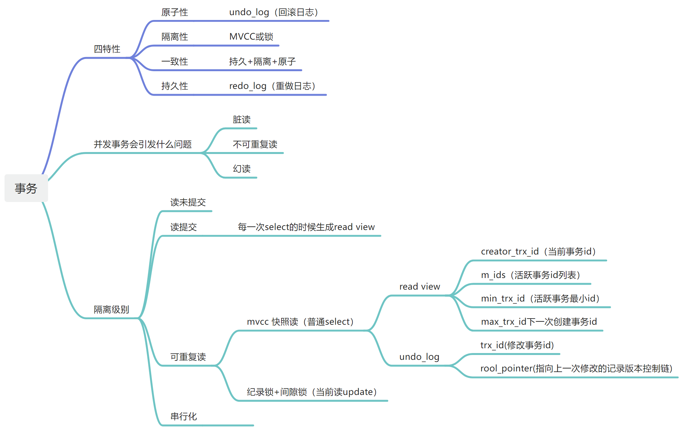
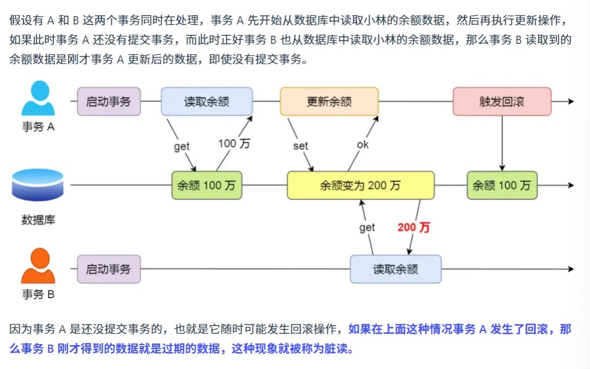
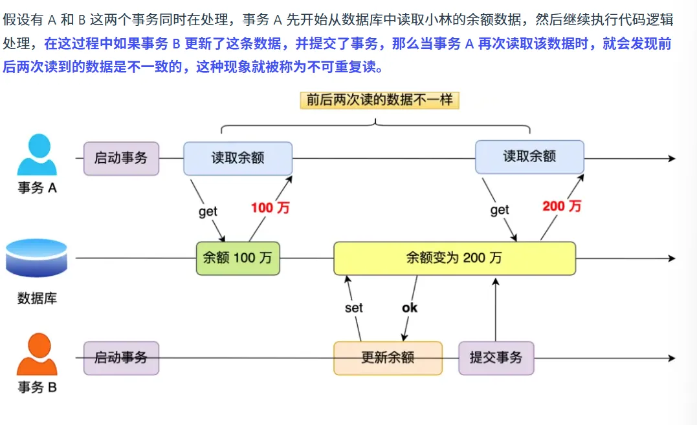
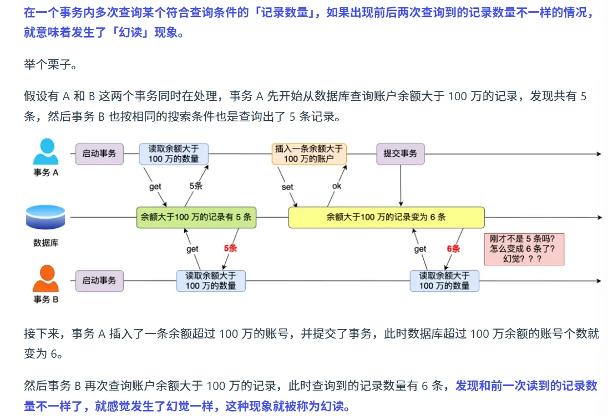
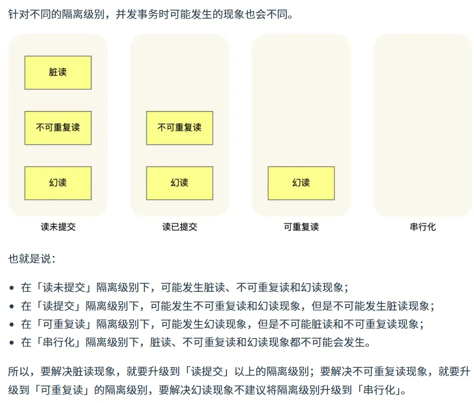
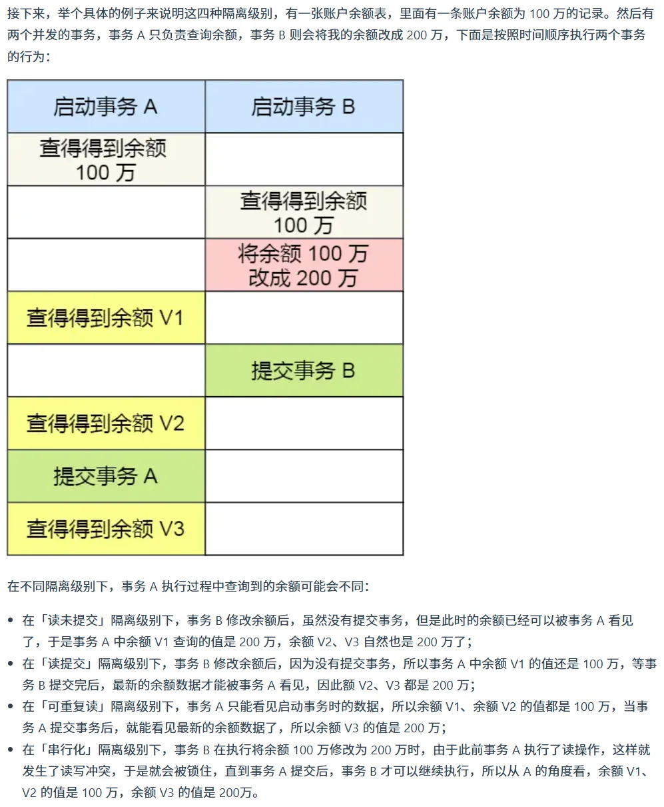

## 事务是什么

指对数据库执行一批操作，在同一个事务当中，这些操作最终要么全部执行成功，要么全部执行失败，不会存在部分成功的情况。

事务是一个原子操作。是一个最小执行单元。可以甶一个或多个SQL语句组成在同一个事务当中，所有的SQL语句都成功执行时，整 个事务成功，有一个SQL语句执行失败，整个事务都执行失败。

## 事务的隔离级别是怎么实现的

事务是由存储引擎实现的，innoDB支持事务，但是原生MyISAM不支持事务

### 事务有哪些特性

**原子性 :** 一个事务中的所有操作要么全部完成,要么全部不完成,不会结束在某个中间环节.而且事务在执行过程中

如果出错就会回滚到未执行状态,就像这个事务从来没有执行过一样.

**一致性:**  是指事务操作前和操作后,数据满足完整性约束,数据库保持一致性状态就比如说转账操作,事务开始前和开始后,两人总金额是不会发生变化的

**隔离性**:  数据库允许多个并发事务同时对其数据进行读写和修改的能力,隔离性可以防止多个事务并发执行时由于交叉执行而导致数据的不一致,因为多个事务同时使用相同数据时,不会互相干扰,每个事务都有一个完整的数据空间,对其他并发事务是隔离的.

**持久性:**事务处理结束后,对数据的修改就是永久的,即便系统故障也不会丢失

### InnoDB引擎通过什么技术来保证事务的这四个特性的呢？

持久性是通过redo log（重做日志来保证的）；

原子性是通过undo log（回滚日志）来保证的；

隔离性是通过MVCC（多版本并发控制）或锁机制来保证的；

一致性则是通过持久性+原子性+隔离性来保证；

### 并发事务会引发什么问题？

在同时处理多个事务的时候，可能会出现脏读，不可重复读，幻读的问题

#### **脏读**

如果一个事务读到了另一个未提交事务修改过的数据，就意味着发生了脏读现象

#### 不可重复读

一个事务内多次读取同一个数据，如果出现前后两次读到的数据不一样的情况，就意味着发生了不可重复读

#### 幻读

在一个事务内多次查询某个条件记录的数量，如果出现前后两次查询到的记录数量不一样的情况，就意味着发生了幻读现象

#### 事务的隔离级别有哪些？

脏读：读到其他事务未提交的数据；

不可重复读：前后读取的数据不一致；

幻读：前后读取的记录数量不一致；

这三个现象的严重程度如下：

脏读>不可重复读>幻读

sql提供了四种隔离级别来规避这种现象，隔离级别越高，性能效率越低

**读未提交**：指一个事务还没提交时，它做的变更就能被其他事务看到；

**读提交：**指一个事务提交之后，它做的变更才能被其他事务看到；

**可重复读：**指一个事务执行过程中，事务开始和结束看到的数据是一致的，MySQL InnoDB引擎的默认隔离级别是可重复读

**串行化**：会对记录加上读写锁，在多个事务对这条记录进行读写操作的时候，如果发生了读写冲突的时候，后访问的事务必须等前一个事务执行完成，才能继续执行；

#### 这四种隔离级别具体是如何实现的呢？

对于**读未提交**隔离级别的事务来说，因为可以读到未提交事务修改的数据，所以直接读取最新的数据就好了；
对于**串行化**隔离级别的事务来说，通过加读写锁的方式来避免并行访问；
对于**读提交和可重复读**隔离级别的事务来说，它们是通过readview来实现的，它们的区别在于创建readview的时机不同，大家可以把readview理解成一个数据快照，就像相机拍照那样，定格某一时刻的风景。

​	读提交隔离级别是在每个语句执行前都会重新生成一个readview,而可重复读隔离级别是启动事务时生成一个readview,然后整个事务期间都在用这个readview。
注意，执行开始事务命令，并不意味着启动了事务。在mysql有两种开启事务的命令，分别是：
第一种：begin/start transaction命令；
第二种： start transaction with consistent snapshot 命令；
这两种开启事务的命令，事务的启动时机是不同的：
执行了begin/starttransaction命令后，并不代表事务启动了。只有在执行了第一条select语句，才是事务真正启动的时机；
执行了 start transaction with consistent snapshot命令，就会马上启动事务。

### MySQL InnoDB默认隔离级别虽然是可重复读，但是很大程度上避免了幻读他也两种解决方案

针对快照读（普通的select语句），是通过MVCC（多版本并发控制）方式解决了幻读,因为可重复读隔离级别下,事务执行过程中看到的数据是一致的,即使中通别的事务插入了一条数据,那么这条记录对这个事务也是看不见的

针对当前读(select...for update),是通过 next-key lock(纪录锁+间隙锁)方式解决了幻读,因为当执行select...for update 语句的时候,会加上 next-keey lock,如果有其他事务在next-key lock锁范围内插入了一条记录,那么这个插入语句就会被阻塞

### Read View（快照读）在mvcc中是如何工作的？

read view有四个字段:

m_ids: 创建read view 时 当前数据库中活跃事务的id列表, 活跃事务指的是启动了服务但还没提交的事务.

min_trx_id:指的是活跃事务中事务id的最小值,也就是m_ids里的最小值

max_trx_id:指的是创建Read View 时当前数据库中应该给下一个事务的id值,也就是全局事务中的id最大值+1

creator_trx_id:指的是创建该Read View的事务id

聚簇索引中的两个隐藏列(也就是undo log)

trx_id :当一个事务对某条聚簇索引记录进行改动时,就会把该事务的事务id记录在trx_id隐藏列里

roll_pointer:每次对某条记录进行改动时,就会把旧版本的记录写入到undo日志中, 这个隐藏列是一个指针,指向每一个旧版本记录,于是就可以通过它找到修改前的记录

在创建read view后我们可以将记录中的trx_id划分为三种情况

一个事务去访问记录的时候，除了自己的更新记录总是可见之外，还有这几种情况：
		如果记录的 trx_id 值小于 read view 中的 min_trx_id 值，表示这个版本的记录是在创建readview前已经提交的事务生成的，所以该版本的记录对当前事务可见。
		如果记录的 trx id 值大于等于read view 中的 max_trx_id 值，表示这个版本的记录是在创建readview后才启动的事务生成的，所以该版本的记录对当前事务不可见。
		如果记录的 trx id 值在 read view的 min_trx_id 和 max_trx_id 之间，需要判断trx ids列表中：
		如果记录的trx_id在 在m_ids列表 列表中，表示生成该版本记录的活跃事务依然活跃着（还没提交事务）,所以该版本的记录对当前事务不可见。
		如果记录的trx_id不在 m-is列表中，表示生成该版本记录的活跃事务已经被提交，所以该版本的记录对当前
事务可见。
这种通过版本链来控制并发事务访问同一个记录时的行为就叫mvcc(多版本并发控制）。