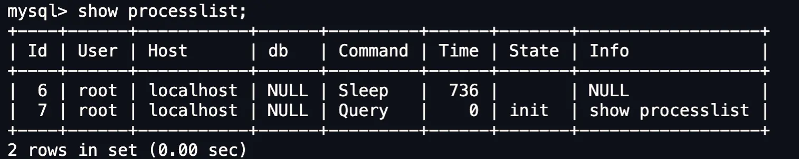
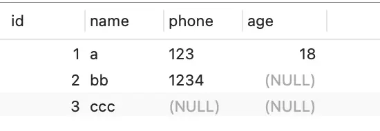
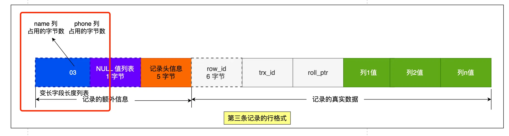
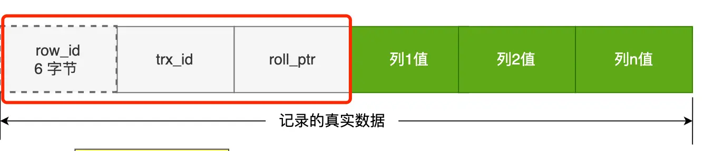

## 执行一个select语句都发生了什么?

### 大概流程


  一个语句的执行分为两层

​	server层:建立连接,分析并执行sql具体有 连接器 查询缓存 解析器 预处理器 优化器 执行器

​    存储引擎层:数据的存储和执行

连接器：建立连接，管理连接，校验用户身份； 


查询缓存：查询语句如果命中查询缓存则直接返回，否则继续往下执行。mysql8.0已删除该换块；

解析器： 解析sql,通过解析器对sol查询语句进行词法分析，语法分析，然后构建语法树，方便后续模块读取表名，字 段，语句类型；

 执行sql:   执行sql共有三个阶段： 

​				预处理阶段：检查表或字段是否存在；将 select 水 中的 符号扩展为表上的所有列。 

​				优化阶段：基于查询成本的考虑，选择查询成本最小的执行计划； 

​				执行阶段：根据执行计划执行sql查询语句，从存储引擎读取记录，返回给客户端；

#### **连接器:**

```mysql
mysql -h$ip -u$user -p$password
##   ip指的是你要连接的服务器所在ip
##   user 指的是用户名,管理员角色为 root
##    -p 是密码
查看数据库的连接情况
## 数据库中输入
show processlist
```



command(命令) 指的是用户当前命令状态 sleep指的是连接完就没有执行命令

query 刚查询过  后面的time 是空闲时间 6号用户已经空闲了736秒  

空闲连接不会一直占用 mysql定义了最大空闲时间,由wait_timeout参数控制默认值是8小时

超出了这个世界连接器就会自动将它断开.

也可以自己断开连接

```cpp
kill connection +x;     //x是id
```

连接限制  用 max_connections 关键字表示 默认的是151 超过这个值就拒绝接下来的连接请求

并报错提示 too many connections

mysql 也和http一样有长短连接的概念区别如下

```cpp
//短连接
连接mysql服务器  tcp三次握手
执行sql
断开tcp四次挥手

//长连接
连接mysql服务器  tcp三次握手
执行sql
...
执行sql
断开tcp四次挥手
```

但是使用长连接可能会导致占用内存增多，因为MySQL在执行查询过程中临时使用内存管理连接对象，这些连接对象资源只有在连接断开的时候才会释放。如果长连接累计很多，将导致MySQL服务占用内存太大，有可能会被系统强制杀掉，这样就会发生MySQL服务器异常重启现象。

怎样解决长连接占用内存的问题呢？

1.定期断开长连接

2.客户端主动断开连接   客户端在执行完了一个很大的操作后在代码里调用 mysql_reset_connection函数来重置链接，达到释放内存的效果，将链接状态恢复到刚刚创建完成时的状态。

#### 查询缓存

查询缓存就是 接受的一条指令之后先去查询缓存看一下,如果有就直接返回,它保存的形式是key -value  key是语句 value 是结果

如果查询缓存没有就去数据库查一下返回并把这个语句和结果存key -value

但是查询缓存命中率太低了,只要表一修改所有的查询缓存就会被清理掉

有点鸡肋所以8.0之后就直接删除了

#### 解析器

解析器只负责检查语法和构建语法树

预处理

检查sql查询语句中的表或者字段是否存在（其他博主扒源码发现的）

将select中的*扩展为表上的所有列

#### 优化器

优化器主要负责将sql查询语句的执行方案确定下来，比如选择使用什么索引

要想知道一条语句使用了什么索引只需要在语句前加上expain命令，结果里面的key字段就是使用了哪个索引

#### 执行器

执行sql语句

> ## 一行数据是如何被存储的

mysql的数据存放在哪个文件？

使用命令

```mysql
show variables like 'datadir'
```

   一般是创建数据库就在/var/lib/mysql/ 里创建一个文件夹名字是数据库名

假如说你有创建了一个表  table1 那么立里面就有三个文件

db.opt 放当前数据库的默认字符集和字符校验规则

table1.frm 放表结构信息

table1.ibd 放表数据也被称为独占表空间文件

表空间文件的结构是怎么样的?

表空间由段(segment) 区(extent) 页 (page)行 (row)组成


1行(row)

数据库表中的数据都是按行存放的

2页(page)

数据库读取数据一次io操作是页为单位,一次最少读取一页 16kb

数据表中的行记录是用数据页来管理的

3区(extent)

innodb不是b+树存储数据  每一层都是通过双向链表连接的,如果按照页来分配存储空间那么可能相邻两页物理位置离得很远,查询的时会产生大量随机i/o

所以如果存储大量数据的时候,按照区来分配存储空间 每个区1mb,对于16kb一页的话连续64个页划分为一个区,这样相邻页直接物理地址也是连着的就能使用顺序i/o了

4段(segment)

表是由各个段组成的,段是由多个区组成的 ,段分为

索引段:存放B+树的非叶子节点区的集合

数据段:存放B+树叶子节点区的集合

回滚段:存放的是回滚数据区的集合,mvcc多版本并发控制就是利用了回滚段实现了多版本并发控制

InnoDB行格式有哪些？

InnoDB提供了四种行格式，分别是Redundant ，Compact，Dynamic和Compressed行格式。

5.1会默认使用compact5，7之后默认使用Dynamic

### compact行格式长什么样子？


### 记录的额外信息


包括：

#### 变长字段长度列表

主要是varchar text blob 类型的列所占的大小而且这个是逆序的






为什么是逆序呢？

因为记录头里存的是指向下一个记录头信息的指针 这样通过指针到下一个记录头信息位置

往左读就是记录头信息往右读就是真实数据

> 每个数据库表的行格式都有变长度字段字节数列表么？

其实变长字段的字节数列表不是必须的。

当数据表没有变长度的时候，比如说全部都是int类型的字段，这时候表里的行格式就不会有变长字段长度列表了，因为没有必要，不如去掉以节省空间

所有变长字段长度列表只出现在数据表有边长字段的时候

#### null值列表

null值列表必须是整字节1字节8比特所有如果要表示至少表示所以如果要至少要有8列不满8列会自动补0，而且也是逆序表示


注意只有可以为空的列才有这个NULL值列表

#### 记录头的信息

delete_mask:标识这条数据是否被删除 1表示删除

next_record:下一条记录位置

record_type:表示当前记录的类型,0表示普通记录1表示b+树非叶子节点记录,2表示最小记录,3表示最大记录

#### **记录的真实数据**

里面除了真实数据还有三个隐藏的字段



row_id:如果不是主键或者唯一约束那么就会有这个row_id用来区分一样的数据 占6字节

trx_id: 事务id,表示这个数据由哪个事务生成的, 占4个字节

rool_pointer,  记录上一个版本的指针

varchar(n)中n最大取值为多少?

### 行溢出后mysql是怎么处理的？

如果一个数据页存不了一条记录， 录，innodb存储引擎会自动将溢出的数据存放到溢出页中。
compact行格式针对行溢出的处理是这样的：当发生行溢出时，在记录的真实数据处只会保存该列的一部分数据，而把剩余的数据放在溢出页中，然后真实数据处用20字节存储指向溢出页的地址，从而可以找到剩余数据所在的页。
compressed和dynamic这两种格式采用完全的行溢出方式，记录的真实数据处不会存储该列的一部分数据，只存储20个字节的指针来指向溢出页。而实际的数据都存储在溢出页中。

### MySQL是怎么知道varchar（）实际占用数据的大小？

MySQL的compact行格式中会用变长字段长度列表存储变长字段实际占用的数据大小

### varchar（n）中n的最大取值为多少？

一行记录最大能存储65535字节 5字节的数据，但是这个是包含变长字段字节数列表所占用的字节数和null值列表所占用的字节数。所以，我们在算varchar(n)中n最大值时，需要减去这两个列表所占用的字节数。
如果一张表只有一个varchar(n)字段，且允许为null,字符集为ascii。varchar(n)中n最大取值为65532.
计算公式：65535-变长字段宇节数列表所占用的宇节数-null值列表所占用的字节数三65535-2-1三
65532.
如果有多个字段的话，要保证所有字段的长度+变长字段字节数列表所占用的字节数+null值列表所占用的字节数6<5535。