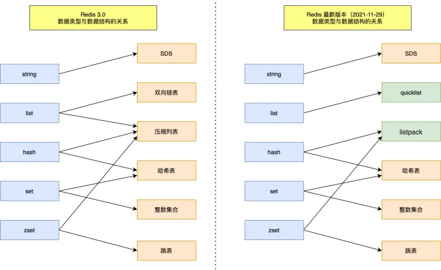
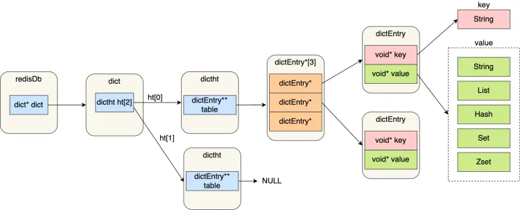
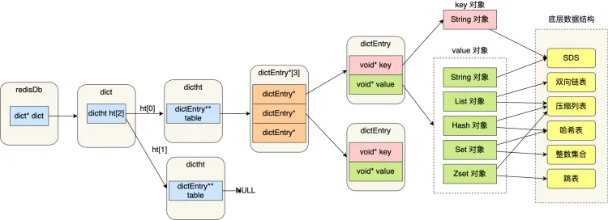
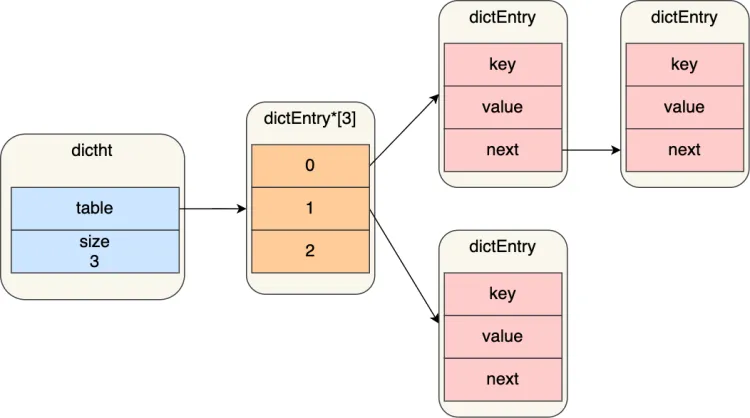
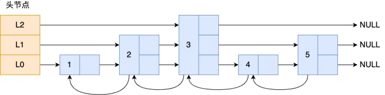

# Redis数据结构

这里主要讲解Redis键值对中值的数据类型，也就是数据的保存形式，其底层实现的方式的数据结构。



## 键值对数据库是怎么实现的？

 Redis 是怎样实现键值对(key-value)数据库的。

Redis 的键值对中的 key 就是字符串对象，而 **value 可以是字符串对象，也可以是集合数据类型的对象**

比如 List 对象、Hash 对象、Set 对象和 Zset 对象。

举个例子：

```
> SET name " 隔壁老王"
OK

> HSET person name "楼下老吴" age 18
0

> RPUSH stu "小帅" "小美"
(integer) 4
```

这些命令代表着:

- 第一条命令:name 是一个**字符串键**，因为键的**值是一个字符串对象**;
- 第二条命令:person 是一个**哈希表键**，因为键的**值是一个包含两个键值对的哈希表对象**,
- 第三条命令:stu 是一个**列表键**，因为键的**值是一个包含两个元素的列表对象**;

这些键值对是如何保存在 Redis 中的呢?

Redis 是使用了一个「哈希表」保存所有键值对，哈希表的最大好处就是让我们可以用 O(1) 的时间复杂度来快速查找到键值对。哈希表其实就是一个数组，数组中的元素叫做哈希桶。

Redis 的哈希桶是怎么保存键值对数据的呢?

哈希桶存放的是指向键值对数据的指针(dictEntry"*)，这样通过指针就能找到键值对数据，然后因为键值对的值可以保存字符串对象和集合数据类型的对象，所以键值对的数据结构中并不是直接保存值本身而是保存了 void * key 和 void*value 指针，分别指向了实际的键对象和值对象，这样一来，即使值是集合数据，也可以通过 void * value 指针找到。

Redis 保存键值对所涉及到的数据结构



- redisDb 结构，表示 Redis 数据库的结构，结构体里存放了指向了 dict 结构的指针;
- dict 结构，结构体里存放了2个哈希表，正常情况下都是用「哈希表1」，「哈希表2」只有在 rehash的时候才用;
- ditctht 结构，表示哈希表的结构，结构里存放了哈希表数组，数组中的每个元素都是指向一个哈希表节点结构(dictEntry)的指针;
- dictEntry 结构，表示哈希表节点的结构，结构里存放了 **void*key 和 void*value 指针， **key 指向的是 String 对象，而 value 则可以指向 String 对象，也可以指向集合类型的对象，比如 List 对象、Hash对象、Set 对象和 Zset 对象**。

特别说明下，void*key 和 void*value 指针指向的是 **Redis 对象**，Redis 中的每个对象都由 redisObject结构表示。

对象结构里包含的成员变量:

- type，标识该对象是什么类型的对象(String 对象、 List 对象、Hash 对象、Set对象和 Zset 对象);
- encoding，标识该对象使用了哪种底层的数据结构;
- **ptr，指问底层数据结构的指针，**

Redis 键值对数据库的全景图



## SDS

Redis 的String 数据类型的底层数据结构是 SDS。

之所以设计SDS结构来表示字符串是因为C语言的char*字符数组有以下缺陷：

1. char*指针只是指向字符数组的起始位置，而**字符数组的结尾位置就是用"\0"表示，意思是指字符串的结束**。因此**C语言获取字符串长度的时间复杂度是O(N)（这是一个可以改进的地方）**。
2. **字符串里面不能含有“\0”字符**，否则最先被程序读入的“\0”字符将被误认为是字符串结尾，这个限制使得C语言的字符串只能保存文本数据，**不能保存像图片、音频、视频文化这样的二进制数据(这也是一个可以改进的地方)**。
3. **C语言的字符串是不会记录自身的缓冲区大小的**，所以 strcat 函数假定程序员在执行这个函数时，已经为dest 分配了足够多的内存，可以容纳 src 字符串中的所有内容，而**一旦这个假定不成立，就会发生缓冲区溢出将可能会造成程序运行终止，(这是一个可以改进的地方)**。

Redis实现的SDS结构可以将上述问题解决。

### SDS结构设计

结构中的每个成员变量分别介绍下:

- **len，记录了字符串长度**。这样获取字符串长度的时候，只需要返回这个成员变量值就行，时间复杂度只需要 O(1)。
- **alloc，分配给字符数组的空间长度**。这样在修改字符串的时候，可以通过a11oc-len 计算出剩余的空间大小，可以用来判断空间是否满足修改需求，如果不满足的话，就会自动将 SDS 的空间扩展至执行修改所需的大小，然后才执行实际的修改操作，所以使用 SDS 既不需要手动修改 SDS 的空间大小,也不会出现前面所说的缓冲区溢出的问题。
- **flags，用来表示不同类型的 SDS**。一共设计了5种类型，分别是sdshdr5、sdshdr8、sdshdr16、sdshdr32和 sdshdr64。
- **buf[]，字符数组，用来保存实际数据**。不仅可以保存字符串，也可以保存二进制数据。

总的来说，Redis 的 SDS 结构在原本字符数组之上，增加了三个元数据:len、aloc、flags，用来解决 C语言字符串的缺陷。

因此有以下几个优点：

1. O(1)复杂度获取字符串长度
   SDS 结构因为加入了 len 成员变量，那么**获取字符串长度的时候，直接返回这个成员变量的值就行，所以复杂度只有 O(1)。**
2. 二进制安全
   SDS 不需要用 “\0”字符来标识字符串结尾了，而是**有个专门的 len 成员变量来记录长度，所以可存储包含“\0”的数据**。
3. 不会发生缓存区溢出
   **当判断出缓冲区大小不够用时，Redis 会自动将扩大 SDS 的空间大小**，且分配额外的「未使用空间」**有效的减少内存分配次数**。
4. 节省内存空间
   **不同类型的结构体，是为了能灵活保存不同大小的字符串，从而有效节省内存空间**，并取消了结构体在编译过程中的内存对齐。

## 链表

### 链表节点结构设计

有前置节点和后置节点，为双向链表。

### 链表结构设计

Redis在listNode结构体的基础上又封装了list这个数据结构，这样操作起来会更方便。链表结构为：

```
typedef struct list {
    //链表头节点
    listNode thead;
    //链表尾节点
    listNode
    *tail;
    //节点值复制函数
    void
    (*dup)(void
    *ptr);
    //节点值释放函数
    void (*free)(void
    *ptr);
    //节点值比较函数
    int (*match)(void *ptr, void *key);
    //链表节点数量
    unsigned long len;
} list;
```

list结构为链表提供了链表头指针head、链表尾节点tail、链表节点数量len、以及可以自定义实现的dup、free、match函数。

### 链表的优势与缺陷

Redis的链表实现优点如下：

- listNode 链表节点的结构里带有 prev 和 next 指针，**获取某个节点的前置节点或后置节点的时间复杂度只需O(1)，而且这两个指针都可以指向 NULL，所以链表是无环链表**;
- list 结构因为提供了表头指针 head 和表尾节点 tail，所以**获取链表的表头节点和表尾节点的时间复杂度只需O(1)**;
- list 结构因为提供了链表节点数量 len，所以**获取链表中的节点数量的时间复杂度只需O(1)**;
- listNode 链表节使用 void* 指针保存节点值，并且可以通过 list 结构的 dup、free、match 函数指针为节点设置该节点类型特定的函数，**因此链表节点可以保存各种不同类型的值**；

链表的缺陷：

- 链表每个节点之间的内存都是不连续的，意味着**无法很好利用 CPU 缓存**。能很好利用 CPU 缓存的数据结构就是数组，因为数组的内存是连续的，这样就可以充分利用CPU 缓存来加速访问。
- 还有一点，保存一个链表节点的值都需要一个链表节点结构头的分配，**内存开销较大**。

因此，Redis 3.0 的 List 对象在数据量比较少的情况下，会采用「压缩列表」作为底层数据结构的实现，它的优势是节省内存空间，并且是内存紧凑型的数据结构。

不过，压缩列表存在性能问题，所以 Redis 在 3.2 版本设计了新的数据结构quicklist，并将 List 对象的底层数据结构改由 quicklist 实现。

然后在 Redis 5.0 设计了新的数据结构listpack，沿用了压缩列表紧凑型的内存布局，最终在最新的 Redis版本，将 Hash 对象和 Zset 对象的底层数据结构实现之一的压缩列表，替换成由 listpack 实现。

## 压缩列表

压缩列表的最大特点，就是它被设计成一种内存紧凑型的数据结构，占用一块连续的内存空间，不仅可以利用 CPU 缓存，而且会针对不同长度的数据，进行相应编码，这种方法可以有效地节省内存开销。

但是，压缩列表的缺陷也是有的:

- 不能保存过多的元素，否则查询效率就会降低;
- 新增或修改某个元素时，压缩列表占用的内存空间需要重新分配，甚至可能引发连锁更新的问题。

因此，Redis 对象(List 对象、Hash 对象、Zset 对象)包含的元素数量较少，或者元素值不大的情况才会使用压缩列表作为底层数据结构。

### 压缩列表结构设计

压缩列表是Redis为了节约内存而开发的，它是**由连续内存块组成的顺序型数据结构**，有点类似于数组。

压缩列表在表头有三个字段：

- **zlbytes**，记录整个压缩列表占用对内存字节数;
- **zltail**，记录压缩列表「尾部」节点距离起始地址由多少字节，也就是列表尾的偏移量
- **zllen**，记录压缩列表包含的节点数量;
- **zlend**，标记压缩列表的结束点，固定值 0xFF(十进制255)

在压缩列表中，如果我们要查找定位第一个元素和最后一个元素，可以通过表头三个字段(zllen)的长度直接定位，复杂度是 0(1)。而**查找其他元素时，就没有这么高效了，只能逐个查找，此时的复杂度就是O(N)了，因此压缩列表不适合保存过多的元素**。

压缩列表节点（entry）包含三部分内容：

- **prevlen**，记录了「前一个节点」的长度，目的是为了实现从后向前遍历;
- **encoding**，记录了当前节点实际数据的「类型和长度」，类型主要有两种:字符串和整数。
- **data**，记录了当前节点的实际数据，类型和长度都由encoding 决定;

当我们往压缩列表中插入数据时，压缩列表就会根据数据类型是字符串还是整数，以及数据的大小，会使用不同空间大小的 preven 和 encoding 这两个元素里保存的信息，**这种根据数据大小和类型进行不同的空间大小分配的设计思想，正是 Redis 为了节省内存而采用的。**

分别说下，prevlen 和 encoding 是如何根据数据的大小和类型来进行不同的空间大小分配。

压缩列表里的每个节点中的 prevlen 属性都记录了「前一个节点的长度|，而且 prevlen 属性的空间大小

跟前一个节点长度值有关，比如:

- 如果前一个节点的长度小于 254 字节，那么 preven 属性需要用1字节的空间来保存这个长度值;
- 如果前一个节点的长度大于等于 254 字节，那么 previen 属性需要用5 字节的空间来保存这个长度值;

encoding 属性的空间大小跟数据是字符串还是整数，以及字符串的长度有关。

- 如果**当前节点的数据是整数**，则 encoding 会使用**1字节的空间**进行编码，也就是 encoding 长度为 1字节。通过 encoding 确认了整数类型，就可以确认整数数据的实际大小了，比如如果 encoding 编码确认了数据是 int16 整数，那么 data 的长度就是 int16 的大小。
- 如果**当前节点的数据是字符串，根据字符串的长度大小**，encoding 会使用**1字节/2字节/5字节的空间**进行编码，encoding 编码的前两个 bit 表示数据的类型，后续的其他 bit 标识字符串数据的实际长度即 data 的长度。

### 压缩列表的缺陷

空间扩展操作也就是重新分配内存，因此**连锁更新一旦发生，就会导致压缩列表占用的内存空间要多次重新分配，这就会直接影响到压缩列表的访问性能。**

所以说，**虽然压缩列表紧凑型的内存布局能节省内存开销，但是如果保存的元素数量增加了，或是元素变大了，会导致内存重新分配，最糟糕的是会有「连锁更新」的问题。**

因此，**压缩列表只会用于保存的节点数量不多的场景**，只要节点数量足够小，即使发生连锁更新，也是能接受的。

虽说如此，Redis 针对压缩列表在设计上的不足，在后来的版本中，新增设计了两种数据结构:quicklist(Redis 3.2 引入)和 listpack(Redis 5.0 引入)。这两种数据结构的设计目标，就是尽可能地保持压缩列表节省内存的优势，同时解决压缩列表的「连锁更新」的问题。

#### 连锁更新问题

**压缩列表新增某个元素或修改某个元素时，如果空间不够，压缩列表占用的内存空间就需要重新分配,而当新插入的元素较大时，可能会导致后续元素的 prevlen 占用空间都发生变化，从而引起「连锁更新」问题，导致每个元素的空间都要重新分配，造成访问压缩列表性能的下降。**

**这种在特殊情况下产生的连续多次空间扩展操作就叫做「连锁更新」**，就像多米诺牌的效应一样。

## 哈希表

哈希表是一种保存键值对(key-value)的数据结构。

哈希表中的每一个 key 都是独一无二的，程序可以根据 key 查找到与之关联的 value，或者通过 key 来更新 value，又或者根据 key 来删除整个 key-value等等。

优点：**以 O(1)的复杂度快速查询数据**。

缺点：在哈希表大小固定的情况下，随着数据不断增多，那么**哈希冲突**的可能性也会越高。

**Redis 采用了「链式哈希」来解决哈希冲突**，在不扩容哈希表的前提下，将具有相同哈希值的数据串起来，形成链接起，以便这些数据在表中仍然可以被查询到。

### 哈希表结构设计

```
typedef struct dictht {
    //哈希表数组
    dictEntry
    table;
    //哈希表大小
    unsigned long size;
    //哈希表大小掩码,用于计算索引值
    unsigned long sizemask;
    //该哈希表已有的节点数量
    unsigned long used;
}dictht;
```

可以看到，哈希表是一个数组(dictEntry **table)，数组的每个元素是一个指向「哈希表节点(dictEntry)」的指针。



哈希表节点的结构如下：

```
typedef struct dictEntry {
    //键值对中的键
    void *key;
    //键值对中的值
    union (
    void *val;
    uint64_t u64;
    int64_t s64;
    double d;
    } v;
    //指向下一个哈希表节点,形成链表
    struct dictEntry next;
} dictentry;
```

dictEntry 结构里不仅包含指向键和值的指针，还包含了指向下一个哈希表节点的指针，这个指针可以将多个哈希值相同的键值对链接起来，以此来解决哈希冲突的问题，这就是链式哈希。

### 哈希冲突

哈希表实际上是一个数组，数组里的每一个元素就是一个哈希桶。

当一个键值对的键经过 Hash 函数计算后得到哈希值，再将(哈希值 % 哈希表大小)取模计算，得到的结果值就是该 key-value 对应的数组元素位置，也就是第几个哈希桶。、

#### 什么是哈希冲突呢

举个例子，有一个可以存放8个哈希桶的哈希表。key1 经过哈希函数计算后，再将「哈希值%8」进行取模计算，结果值为 1，那么就对应哈希桶 1，类似的，key9 和 key10 分别对应哈希桶1和桶 6。

此时，key1 和 key9 对应到了相同的哈希桶中，这就发生了哈希冲突。

因此，**当有两个以上数量的 kay 被分配到了哈希表中同一个哈希桶上时，此时称这些 key 发生了冲突。**

### 链式哈希

Redis采用了链式哈希的方法解决哈希冲突。

#### 链式哈希怎么实现的？

实现的方式就是每个哈希表节点都有一个 next 指针，用于指向下一个哈希表节点，因此多个哈希表节点可以用 next 指针构成一个单项链表，**被分配到同一个哈希桶上的多个节点可以用这个单项链表连接起来，这样就解决了哈希冲突。**

还是用前面的哈希冲突例子，key1 和 key9 经过哈希计算后，都落在同一个哈希桶，链式哈希的话，key1就会通过 next 指针指向 key9，形成一个单向链表。

不过，链式哈希局限性也很明显，随着链表长度的增加，在查询这一位置上的数据的耗时就会增加，毕竟链表的查询的时间复杂度是 O(n)。

要想解决这一问题，就需要进行rehash，也就是对哈希表的大小进行扩展。

### rehash

在实际使用哈希表时，Redis 定义一个 dict 结构体，这个结构体里定义了两个哈希表(ht[2])。

之所以定义了两个哈希表，是因为进行rehash的时候，需要用上两个哈希表。

在正常服务请求阶段，插入的数据，都会写入到「哈希表1」，此时的「哈希表2」 并没有被分配空间。

随着数据逐步增多，触发了 rehash 操作，这个过程分为三步:

- ·给「哈希表 2」分配空间，一般会比「哈希表1」大一倍(两倍的意思);
- 将「哈希表1」的数据迁移到「哈希表 2」 中;
- 迁移完成后，「哈希表1」的空间会被释放，并把「哈希表 2」设置为「哈希表1」，然后在「哈希表2」 新创建一个空白的哈希表，为下次 rehash 做准备。

这个过程看起来简单，但是其实第二步很有问题，**如果哈希表1的数据非常庞大，那么在迁移至哈希表2的时候，因为会涉及大量的数据拷贝，此时可能会对Redis造成阻塞，无法服务其他请求。**

### 渐进式rehash

为了避免 rehash 在数据迁移过程中，因拷贝数据的耗时，影响 Redis 性能的情况，所以 Redis 采用了渐进式 rehash，也就是将数据的迁移的工作不再是一次性迁移完成，而是分多次迁移。

渐进式 rehash 步骤如下:

- 给「哈希表 2」分配空间;
- **在 rehash 进行期间，每次哈希表元素进行新增、删除、查找或者更新操作时，Redis 除了会执行对应的操作之外，还会顺序将「哈希表1」中索引位置上的所有 key-value 迁移到「哈希表 2」 上;**
- 随着处理客户端发起的哈希表操作请求数量越多，最终在某个时间点会把「哈希表1」的所有 keyvalue 迁移到「哈希表 2」，从而完成 rehash 操作。

这样就巧妙地把一次性大量数据迁移工作的开销，分摊到了多次处理请求的过程中，避免了一次性 rehash的耗时操作。

在进行渐进式 rehash 的过程中，会有两个哈希表，所以在渐进式 rehash 进行期间，哈希表元素的删除、查找、更新等操作都会在这两个哈希表进行。

比如，查找一个 key 的值的话，先会在「哈希表1」里面进行查找，如果没找到，就会继续到哈希表2里面进行找到。

另外，在渐进式 rehash 进行期间，新增一个 key-value 时，会被保存到「哈希表2」里面，而「哈希表1」则不再进行任何添加操作，这样保证了「哈希表1」的 key-value 数量只会减少，随着 rehash 操作的完成，最终「哈希表1」就会变成空表，

而rehash 的触发条件跟**负载因子(load factor)**有关系。

负载因子可以通过下面这个公式计算:
$$
                            负载因子 = 哈希表已保存节点数量 / 哈希表大小
$$
触发 rehash 操作的条件，主要有两个:

- **当负载因子大于等于1，并且 Redis 没有在执行 bgsave 命令或者 bgrewiteaof 命令，也就是没有执行RDB 快照或没有进行 AOF 重写的时候，就会进行 rehash 操作。**
- **当负载因子大于等于5时，此时说明哈希冲突非常严重了，不管有没有有在执行 RDB 快照或 AOF 重写，都会强制进行 rehash 操作。**

## 整数集合

整数集合是 Set 对象的底层实现之一。当一个 Set 对象只包含整数值元素，并且元素数量不大时，就会使用整数集这个数据结构作为底层实现。

### 整数集合结构设计

整数集合的本质是一块连续内存空间，它的结构定义如下：

```
typedef struct intset {
    //编码方式
    uint32_t encoding
    //集合包含的元素数量
    uint32 t length;
    //保存元素的数组
    int8_t contents[];
}intset;
```

可以看到，保存元素的容器是一个 contents 数组，虽然 contents 被声明为 int8_t类型的数组，但是实际上 contents 数组并不保存任何 int8_t 类型的元素，contents 数组的真正类型取决于 intset 结构体里的encoding 属性的值。比如:

- 如果 encoding 属性值为 INTSET_ENC INT16，那么 contents 就是一个 int16_t类型的数组，数组中每一个元素的类型都是 int16_t;
- 如果 encoding 属性值为 INTSET_ENC_INT32，那么 contents 就是一个 int32_t类型的数组，数组中每一个元素的类型都是 int32_t;
- 如果 encoding 属性值为 INTSET_ENC_INT64，那么 contents 就是一个 int64_t类型的数组，数组中每-个元素的类型都是 int64_t;

不同类型的 contents 数组，意味着数组的大小也会不同。

### 整数集合的升级操作

整数集合会有一个升级规则，就是当我们将一个新元素加入到整数集合里面，如果新元素的类型(int32_t)比整数集合现有所有元素的类型(int16_t)都要长时，整数集合需要先进行升级，也就是按新元素的类型(int32_t)扩展 contents 数组的空间大小，然后才能将新元素加入到整数集合里，当然升级的过程中，也要维持整数集合的有序性。

**整数集合升级的过程不会重新分配一个新类型的数组，而是在原本的数组上扩展空间，然后在将每个元素按间隔类型大小分割，如果 encoding 属性值为 INTSET_ENC_INT16，则每个元素的间隔就是 16 位。**

#### 整数集合升级有什么好处呢？

如果要让一个数组同时保存 int16_t、int32_t、int64_t 类型的元素，最简单做法就是直接使用 int64_t 类型的数组。不过这样的话，当如果元素都是 int16_t 类型的，就会造成内存浪费的情况。

整数集合升级就能避免这种情况，如果一直向整数集合添加 int16_t 类型的元素，那么整数集合的底层实现就一直是用 int16_t 类型的数组，只有在我们要将 int32_t 类型或 int64_t 类型的元素添加到集合时，才会对数组进行升级操作。

因此，整数集合升级的好处是节省内存资源。

#### 整数集合支持降级操作吗？

**不支持降级操作**，一旦对数组进行了升级，就会一直保持升级后的状态。

## 跳表

Redis 只有 Zset 对象的底层实现用到了跳表，跳表的优势是能支持平均 O(logN) 复杂度的节点查找。

zset 结构体里有两个数据结构：一个是跳表，一个是哈希表。这样的好处是既能进行高效的范围查询，也能进行高效单点查询。

```
typedef struct zset {
    dict *dict;
    zskiplist *zsl;
} zset;
```

set 对象在执行数据插入或是数据更新的过程中，会依次在跳表和哈希表中插入或更新相应的数据，从而保证了跳表和哈希表中记录的信息一致。

Zset 对象能支持范围查询（如 ZRANGEBYSCORE 操作），这是因为它的数据结构设计采用了**跳表**，而又能以常数复杂度获取元素权重（如 ZSCORE 操作），这是因为它同时采用了**哈希表**进行索引。

虽然Zset 对象在使用跳表作为数据结构的时候，是使用由「哈希表+跳表」组成的 struct zset，但是struct zset 中的哈希表只是用于以常数复杂度获取元素权重，其余大部分操作都是跳表实现的。

### 跳表结构设计

链表在查找元素的时候，因为需要逐一查找，所以查询效率非常低，时间复杂度是O(N)，于是就出现了跳表。**跳表是在链表基础上改进过来的，实现了一种「多层」的有序链表**，这样的好处是能快读定位数据。

跳表结构:



图中头节点有 L0~L2 三个头指针，分别指向了不同层级的节点，然后每个层级的节点都通过指针连接起来：

- L0 层级共有 5 个节点，分别是节点1、2、3、4、5；
- L1 层级共有 3 个节点，分别是节点 2、3、5；
- L2 层级只有 1 个节点，也就是节点 3 。

如果我们要在链表中查找节点 4 这个元素，只能从头开始遍历链表，需要查找 4 次，而使用了跳表后，只需要查找 2 次就能定位到节点 4，因为可以在头节点直接从 L2 层级跳到节点 3，然后再往前遍历找到节点 4。

可以看到，这个查找过程就是在多个层级上跳来跳去，最后定位到元素。当数据量很大时，跳表的查找复杂度就是 O(logN)。

跳表节点数据结构：

```
typedef struct zskiplistNode {
    //Zset 对象的元素值
    sds ele
;
    //元素权重值
    double score;
    //后向指针
    struct zskiplistNode *backward;
  
    //节点的level数组，保存每层上的前向指针和跨度
    struct zskiplistLevel {
        struct zskiplistNode *forward;
        unsigned long span;
    } level[];
} zskiplistNode;
```

Zset 对象要同时保存「元素」和「元素的权重」，对应到跳表节点结构里就是 sds 类型的 ele 变量和 double 类型的 score 变量。每个跳表节点都有一个后向指针（struct zskiplistNode *backward），指向前一个节点，目的是为了方便从跳表的尾节点开始访问节点，这样倒序查找时很方便。

跳表是一个带有层级关系的链表，而且每一层级可以包含多个节点，每一个节点通过指针连接起来，实现这一特性就是靠跳表节点结构体中的zskiplistLevel 结构体类型的 level 数组。

level 数组中的每一个元素代表跳表的一层，也就是由 zskiplistLevel 结构体表示，比如 leve[0] 就表示第一层，leve[1] 就表示第二层。zskiplistLevel 结构体里定义了「指向下一个跳表节点的指针」和「跨度」，跨度时用来记录两个节点之间的距离。

**跨度实际上是为了计算这个节点在跳表中的排位。**具体怎么做的呢？因为跳表中的节点都是按序排列的，那么计算某个节点排位的时候，从头节点点到该结点的查询路径上，将沿途访问过的所有层的跨度累加起来，得到的结果就是目标节点在跳表中的排位。

跳表结构体：

```
typedef struct zskiplist {
    struct zskiplistNode *header, *tail;
    unsigned long length;
    int level;
} zskiplist;
```

跳表结构里包含了：

- 跳表的头尾节点，便于在O(1)时间复杂度内访问跳表的头节点和尾节点；
- 跳表的长度，便于在O(1)时间复杂度获取跳表节点的数量；
- 跳表的最大层数，便于在O(1)时间复杂度获取跳表中层高最大的那个节点的层数量；

### 跳表节点查询过程

查找一个跳表节点的过程时，跳表会从头节点的最高层开始，逐一遍历每一层。在遍历某一层的跳表节点时，会用跳表节点中的 SDS 类型的元素和元素的权重来进行判断，共有两个判断条件：

- 如果当前节点的权重「小于」要查找的权重时，跳表就会访问该层上的下一个节点。
- 如果当前节点的权重「等于」要查找的权重时，并且当前节点的 SDS 类型数据「小于」要查找的数据时，跳表就会访问该层上的下一个节点。

如果上面两个条件都不满足，或者下一个节点为空时，跳表就会使用目前遍历到的节点的 level 数组里的下一层指针，然后沿着下一层指针继续查找，这就相当于跳到了下一层接着查找。

### 跳表节点层数设置

跳表的相邻两层的节点数量的比例会影响跳表的查询性能。

**跳表的相邻两层的节点数量最理想的比例是 2:1，查找复杂度可以降低到 O(logN)。**

#### 那怎样才能维持相邻两层的节点数量的比例为 2 : 1 呢？

如果采用新增节点或者删除节点时，来调整跳表节点以维持比例的方法的话，会带来额外的开销。

Redis 则采用一种巧妙的方法是，**跳表在创建节点的时候，随机生成每个节点的层数**，并没有严格维持相邻两层的节点数量比例为 2 : 1 的情况。

具体的做法是，**跳表在创建节点时候，会生成范围为[0-1]的一个随机数，如果这个随机数小于 0.25（相当于概率 25%），那么层数就增加 1 层，然后继续生成下一个随机数，直到随机数的结果大于 0.25 结束，最终确定该节点的层数。**

这样的做法，相当于每增加一层的概率不超过 25%，层数越高，概率越低，层高最大限制是 64。

虽然我前面讲解跳表的时候，图中的跳表的「头节点」都是 3 层高，**但是其实如果层高最大限制是 64，那么在创建跳表「头节点」的时候，就会直接创建 64 层高的头节点**。

### 为什么用跳表而不用平衡树？

主要是从内存占用、对范围查找的支持、实现难易程度这三方面总结的原因：

- **从内存占用上来比较，跳表比平衡树更灵活一些。**平衡树每个节点包含 2 个指针（分别指向左右子树），而跳表每个节点包含的指针数目平均为 1/(1-p)，具体取决于参数 p 的大小。如果像 Redis里的实现一样，取 p=1/4，那么平均每个节点包含 1.33 个指针，比平衡树更有优势。
- **在做范围查找的时候，跳表比平衡树操作要简单。**在平衡树上，我们找到指定范围的小值之后，还需要以中序遍历的顺序继续寻找其它不超过大值的节点。如果不对平衡树进行一定的改造，这里的中序遍历并不容易实现。而在跳表上进行范围查找就非常简单，只需要在找到小值之后，对第 1 层链表进行若干步的遍历就可以实现。
- **从算法实现难度上来比较，跳表比平衡树要简单得多**。平衡树的插入和删除操作可能引发子树的调整，逻辑复杂，而跳表的插入和删除只需要修改相邻节点的指针，操作简单又快速。

## quicklist

在 Redis 3.0 之前，List 对象的底层数据结构是双向链表或者压缩列表。然后在 Redis 3.2 的时候，List 对象的底层改由 quicklist 数据结构实现。

其实 quicklist 就是「双向链表 + 压缩列表」组合，因为一个 quicklist 就是一个链表，而链表中的每个元素又是一个压缩列表。

在前面讲压缩列表的时候，我也提到了压缩列表的不足，虽然压缩列表是通过紧凑型的内存布局节省了内存开销，但是因为它的结构设计，如果保存的元素数量增加，或者元素变大了，压缩列表会有「连锁更新」的风险，一旦发生，会造成性能下降。

quicklist 解决办法，**通过控制每个链表节点中的压缩列表的大小或者元素个数，来规避连锁更新的问题。因为压缩列表元素越少或越小，连锁更新带来的影响就越小，从而提供了更好的访问性能。**

## listpack

quicklist 虽然通过控制 quicklistNode 结构里的压缩列表的大小或者元素个数，来减少连锁更新带来的性能影响，但是并没有完全解决连锁更新的问题。

因为 quicklistNode 还是用了压缩列表来保存元素，压缩列表连锁更新的问题，来源于它的结构设计，所以要想彻底解决这个问题，需要设计一个新的数据结构。

于是，Redis 在 5.0 新设计一个数据结构叫 listpack，目的是替代压缩列表，它最大特点是 listpack 中每个节点不再包含前一个节点的长度了，压缩列表每个节点正因为需要保存前一个节点的长度字段，就会有连锁更新的隐患。

**listpack 没有压缩列表中记录前一个节点长度的字段了，listpack 只记录当前节点的长度，当我们向 listpack 加入一个新元素的时候，不会影响其他节点的长度字段的变化，从而避免了压缩列表的连锁更新问题。**

------

> 图片出处为小林coding